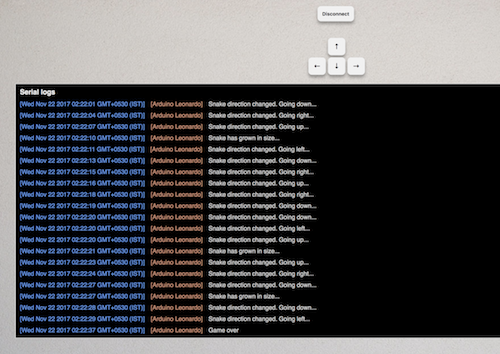

WebUSB - Snake
==============
My experiments with WebUSB API. Ported age old snake game to run on Arduino board controlled from the web using WebUSB APIs.

Web app
-------
Web app is available under `web` folder. This folder contains static html and JS files. Start any local server to serve these contents. Update [sketch file](./sketch/sketch.ino) with the port number and scheme (HTTPS-1, HTTP-0)

Sketch
------
Sketch is available under `sketch` folder. This project depends on WebUSB library. Follow this [getting started](https://github.com/webusb/arduino/blob/gh-pages/README.md#getting-started) guide to download and prepare the library. Upload the sketch to Arduino. Once the sketch is uploaded, Chrome will show a pop-up with the web page URL. Go to the web page to connect to the Arduino board.

Pre-requisites
--------------
- [Arduino Leonardo](https://store.arduino.cc/arduino-leonardo-with-headers) (You can use other [compatible boards](https://github.com/webusb/arduino) as well)
- [TFT LCD screen](https://roboindia.com/tutorials/direct.php?route=2.4-touch-lcd-arduino)

Screenshots
-----------

Browser support
---------------
WebUSB API is currently available in Chrome only. Tested in Chrome 62.

License
-------
The source code is available [here](https://github.com/varunkumar/webusb-snake) under [MIT licence](http://varunkumar.mit-license.org/). Feel free to use any part of the code. Please send any bugs, feedback, complaints, patches to me at varunkumar[dot]n[at]gmail[dot]com.

-- [Varun](http://www.varunkumar.me)
